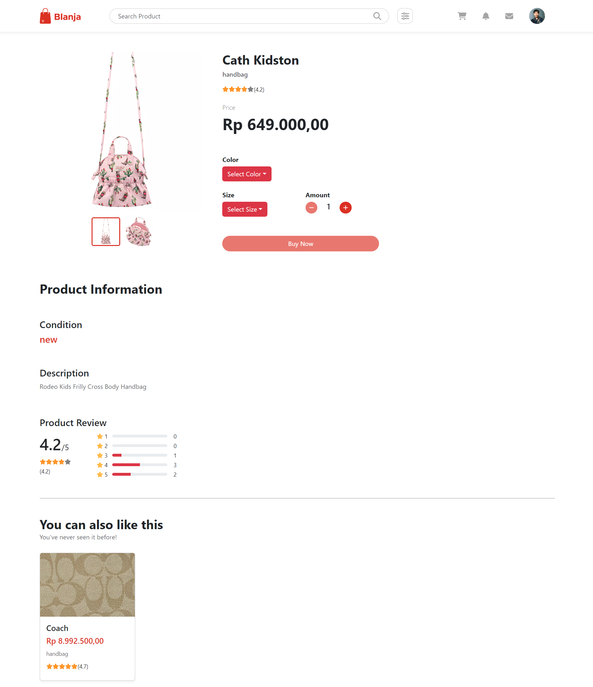
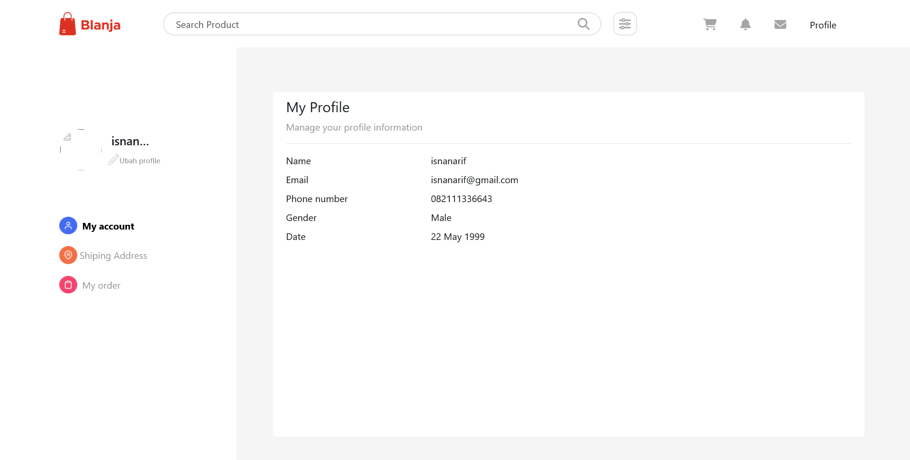
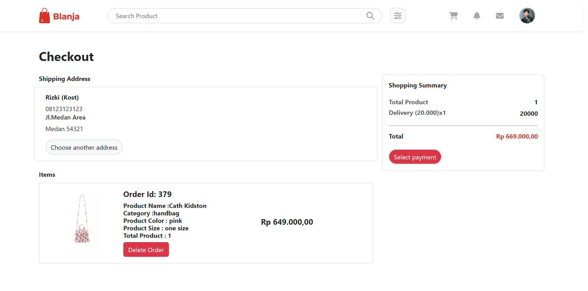
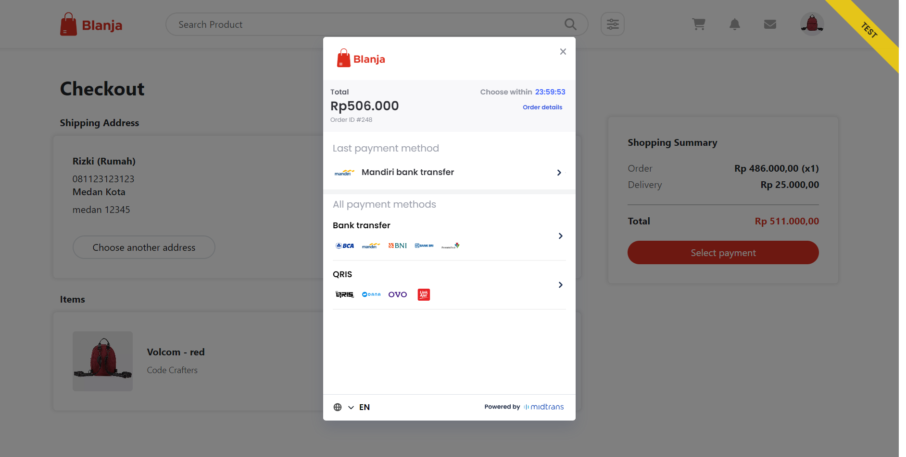

# Blanja Portfolio 🛍️👗👠

## Project Description 🚀

"Blanja" is a project portfolio that I have collaborated on as part of a project team. This platform is an e-commerce website that specifically focuses on fashion products. With a user-friendly interface and a wide range of fashion items, "Blanja" provides users with a convenient and engaging online shopping experience.

## Technologies Used 💻🛠️

The Blanja project is built using the following technologies:

- HTML
- CSS
- JavaScript
- Bootstrap
- JQuery
- Redux (State management)
- SASS (Syntactically Awesome Style Sheets)
- React (Frontend framework)
- Sweet Alert (Alert library)
- Skeleton (Responsive CSS framework)
- Node.Js (JavaScript runtime)
- Axios (HTTP client)

## Project Repository 📂🔗

The backend repository for this project can be found on GitHub at the following link:
[Blanja Backend Repository](https://github.com/nluthfis/blanja-fe)

## Features ✨🛍️👕👖

- User-friendly e-commerce website with a focus on fashion products
- Browse and search for fashion items
- Add products to the shopping cart
- Place orders and make payments
- User authentication and account management
- State management with Redux for improved performance
- Responsive design using Bootstrap and Skeleton
- Interactive alerts with Sweet Alert
- Asynchronous data handling with Axios

## Screenshots 📸

<table>
  <tr>
    <td>Login Page</td>
    <td>Register Page </td>
  </tr>
   <tr>
    <td></td>
    <td> </td>
  </tr>
  <tr>
    <td>Home Page</td>
    <td>Details Product Page</td>
  </tr>
  <tr>
    <td></td>
    <td> </td>
  </tr>
  <tr>
    <td>Profile Page</td>
    <td>Profile Page Section Address</td>
  </tr>
  <tr>
    <td> </td>
    <td></td>
  </tr>
   <tr>
    <td>Profile Page Section MyOrder</td>
    <td>Check Out Page</td>
     <td>Payment Page</td>
  </tr>
  <tr>
    <td></td>
    <td> </td>
    <td> </td>
  </tr>
</table>

## Getting Started 🏁🚀

To set up the Blanja project locally, follow these steps:

1. Clone the repository from the provided link.
2. Install the required dependencies using npm.
3. Set up your database and update the configuration accordingly.
4. Ensure you have Node.js and npm installed on your system.
5. Start the development server using the command `npm start`.
6. Access the project through your preferred web browser.

## Contributions 🤝🌟

As part of a project team, contributions to "Blanja" were made collectively. For specific inquiries or suggestions, please contact the project team members through the GitHub repository.

## License 📜📝

As the specific licensing information for "Blanja" may vary based on the project team's decisions, please refer to the LICENSE file in the project repository for details.

## Related Project

[Demo Website](https://blanja-fe-sigma.vercel.app)  
[Backend Blanja](https://github.com/nluthfis/blanja-be)

Thank you for exploring my Blanja portfolio. "Blanja" has been an exciting project to work on, and we hope that it showcases our skills and passion for creating an engaging e-commerce platform. Happy shopping! 🛍️👠👗
